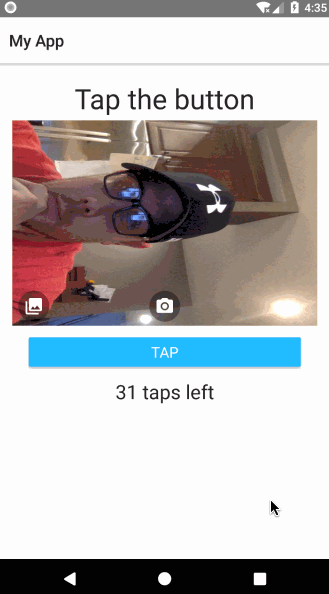

<a align="center" href="https://www.npmjs.com/package/@nstudio/nativescript-camera-plus">
    <h3 align="center">NativeScript Camera Plus</h3>
</a>
<h4 align="center">A NativeScript camera with all the bells and whistles which can be embedded inside a view. This plugin was sponsored by LiveShopper</h4>

<p align="center">
<a href="https://liveshopper.com">
    
    <a>
</p>

<p align="center">
    <a href="https://www.npmjs.com/package/@nstudio/nativescript-camera-plus">
        
    </a>
    <a href="https://www.npmjs.com/package/@nstudio/nativescript-camera-plus">
        
    </a>
    <a href="https://www.npmjs.com/package/@nstudio/nativescript-camera-plus">
        
    </a>
    <a href="https://github.com/nstudio/nativescript-camera-plus/stargazers">
        
    </a>
     <a href="https://github.com/nstudio/nativescript-camera-plus/network">
        
    </a>
    <a href="https://github.com/nstudio/nativescript-camera-plus/blob/master/LICENSE.md">
        
    </a>
</p>

<p align="center">
    <a align="center" href="http://nstudio.io">
      
    </a>
    <h5 align="center">Do you need assistance on your project or plugin? Contact the nStudio team anytime at <a href="mailto:team@nstudio.io">team@nstudio.io</a> to get up to speed with the best practices in mobile and web app development.
    </h5>
</p>

---

## Installation

```bash
ns plugin add @nstudio/nativescript-camera-plus
```

**Note :- Android**
 Please add the following to your app.gradle
 
 ```gradle
android {
...
  compileOptions {
        sourceCompatibility JavaVersion.VERSION_1_8
        targetCompatibility JavaVersion.VERSION_1_8
    }
}
```

## Sample

_Yes the camera is rotated because it's a webcam to an emulator and it's just the way life works_



## Demo

The demo apps work best when run on a real device.
You can launch them from the simulator/emulator however the camera does not work on iOS simulators. Android emulators will work with cameras if you enable your webcam.

### Android Emulator Note

The camera in your webcam being used on emulators will likely be rotated sideways (incorrectly). The actual camera output will be correctly oriented, it's only the preview on emulators that present the preview incorrectly. This issue shouldn't be present on real devices due to the camera being oriented correctly on the device vs. a webcam in a computer.

### Run Vanilla Demo

Plug device in then:

```bash
npm run demo.ios
// or...
npm run demo.android
```

### Run Angular Demo

Plug device in then:

```bash
npm run demo.ng.ios
// or...
npm run demo.ng.android
```

## Properties

| Name                  | Type    | Default      | Description                                                                                                      |
| --------------------- | ------- | ------------ | ---------------------------------------------------------------------------------------------------------------- |
| **debug**             | boolean | _false_      | If true logs will be output in the console to help debug the Camera Plus events.                                 |
| **confirmPhotos**     | boolean | _true_       | If true the default take picture event will present a confirmation dialog before saving.                         |
| **confirmRetakeText** | string  | _'Retake'_   | When confirming capture this text will be presented to the user to retake the photo.                             |
| **confirmSaveText**   | string  | _'Save'_     | When confirming capture this text will be presented to the user to save the photo.                               |
| **saveToGallery**     | boolean | _true_       | If true the default take picture event will save to device gallery.                                              |
| **galleryPickerMode** | string  | _'multiple'_ | The gallery/library selection mode. 'single' allows one image to be selected. 'multiple' allows multiple images. |
| **showFlashIcon**     | boolean | _true_       | If true the default flash toggle icon/button will show on the Camera Plus layout.                                |
| **showToggleIcon**    | boolean | _true_       | If true the default camera toggle (front/back) icon button will show on the Camera Plus layout.                  |
| **showCaptureIcon**   | boolean | _true_       | If true the default capture (take picture) icon/button will show on the Camera Plus layout.                      |
| **showGalleryIcon**   | boolean | _true_       | If true the choose from gallery/library icon/button will show on the Camera Plus layout.                         |
| **enableVideo**       | boolean | _fale_       | If true the CameraPlus instance can record video and videos are shown in the gallery.                            |

## Static Properties

_Note: These properties need set before the initialization of the camera. Users should set these in a component constructor before their view creates the component if the wish to change the default values. In case of enableVideo, this will be true if either the static property or the component property is true._

| Name              | Type        | Description                                                                                                                                      |
| ----------------- | ----------- | ------------------------------------------------------------------------------------------------------------------------------------------------ |
| **enableVideo**   | boolean     | Video Support (off by default). Can reset it before using in different views if they want to go back/forth between photo/camera and video/camera |
| **defaultCamera** | CameraTypes | Defaults the camera correctly on launch. Default `'rear'`. `'front'` or `'rear'`                                                                 |

## Android Only Properties

| Name                 | Type    | Description                                                                                 |
| -------------------- | ------- | ------------------------------------------------------------------------------------------- |
| **flashOnIcon**      | string  | Name of app_resource drawable for the native image button when flash is on (enabled).       |
| **flashOffIcon**     | string  | Name of app_resource drawable for the native image button when flash is off (disabled).     |
| **toggleCameraIcon** | string  | Name of app_resource drawable for the toggle camera button.                                 |
| **takePicIcon**      | string  | Name of app_resource drawable for the take picture (capture) button.                        |
| **galleryIcon**      | string  | Name of app_resource drawable for the open gallery (image library) button.                  |
| **autoFocus**        | boolean | If true the camera will use continuous focus when the camera detects changes of the target. |

## iOS Only Properties

| Name                      | Type    | Description                                                   |
| ------------------------- | ------- | ------------------------------------------------------------- |
| **doubleTapCameraSwitch** | boolean | Enable/disable double tap gesture to switch camera. (enabled) |

## Cross Platform Public Methods

| Method                                       | Description                                                                                                                                                     |
| -------------------------------------------- | --------------------------------------------------------------------------------------------------------------------------------------------------------------- |
| **isCameraAvailable()**                      | Returns true if the device has at least one camera.                                                                                                             |
| **toggleFlash()**                            | Toggles the flash mode on the active camera.                                                                                                                    |
| **toggleCamera()**                           | Toggles the active camera on the device.                                                                                                                        |
| **chooseFromLibrary(opts?: IChooseOptions)** | Opens the device gallery (image library) for selecting images.                                                                                                  |
| **takePicture(opts?: ICaptureOptions)**      | Takes a picture of the current preview in the CameraPlus.                                                                                                       |
| **getFlashMode(): string**                   | Android: various strings possible: https://developer.android.com/reference/android/hardware/Camera.Parameters.html#getFlashMode() iOS: either `'on'` or `'off'` |
| **record(opts?: IVideoOptions)**             | Starts recording a video.                                                                                                                                       |
| **stop()**                                   | Stops the video recording, when stopped the `videoRecordingReadyEvent` event will be emitted.                                                                   |

## Android Only Public Methods

| Method                                                  | Description                                                                                                                                         |
| ------------------------------------------------------- | --------------------------------------------------------------------------------------------------------------------------------------------------- |
| **requestCameraPermissions(explanationText?: string)**  | Prompts the user to grant runtime permission to use the device camera. Returns a Promise<boolean>.                                                  |
| **hasCameraPermission()**                               | Returns true if the application has been granted access to the device camera.                                                                       |
| **requestStoragePermissions(explanationText?: string)** | Prompts the user to grant runtime permission to use external storage for saving and opening images from device gallery. Returns a Promise<boolean>. |
| **hasStoragePermissions()**                             | Returns true if the application has been granted access to the device storage.                                                                      |
| **getNumberOfCameras()**                                | Returns the number of cameras on the device.                                                                                                        |
| **hasFlash()**                                          | Returns true if the active camera has a flash mode.                                                                                                 |

## Events

| Name                            | Description                                                                            |
| ------------------------------- | -------------------------------------------------------------------------------------- |
| **errorEvent**                  | Executes when an error is emitted from CameraPlus                                      |
| **photoCapturedEvent**          | Executes when a photo is taken.                                                        |
| **toggleCameraEvent**           | Executes when the device camera is toggled.                                            |
| **imagesSelectedEvent**         | Executes when images are selected from the device library/gallery.                     |
| **videoRecordingStartedEvent**  | Executes when video starts recording.                                                  |
| **videoRecordingFinishedEvent** | Executes when video stops recording but has not process yet.                           |
| **videoRecordingReadyEvent**    | Executes when video has completed processing and is ready to be used.                  |
| **confirmScreenShownEvent**     | Executes when the picture confirm dialog is shown..                                    |
| **confirmScreenDismissedEvent** | Executes when the picture confirm dialog is dismissed either by Retake or Save button. |

## Option Interfaces

```TS
export interface ICameraOptions {
  confirm?: boolean;
  saveToGallery?: boolean;
  keepAspectRatio?: boolean;
  height?: number;
  width?: number;
  autoSquareCrop?: boolean;
  confirmRetakeText?: string;
  confirmSaveText?: string;
}
```

```TS
export interface IChooseOptions {
  width?: number;
  height?: number;
  keepAspectRatio?: boolean;
  showImages?:  boolean;
  showVideos?: boolean;
}
```

```TS
export interface IVideoOptions {
  quality?: CameraVideoQuality;
  confirm?: boolean;
  saveToGallery?: boolean;
  height?: number;
  width?: number;
  disableHEVC?: boolean;
  androidMaxVideoBitRate?: number;
  androidMaxFrameRate?: number;
  androidMaxAudioBitRate?: number;
}
```

### Contributing

1. Fork and clone the repo.
2. Execute `npm run dev.setup` in the root of the repo in your clone.
3. Execute `npm run demo.android` or `npm run demo.ios` to start the demo app on the platform provided. If you have a device connected to your computer then it should start the app on the device. If not, an emulator/simulator should start.
4. Lastly, you should be able to make changes to the source files in the `src` directory of the plugin and changes by synced to your running demo app.
